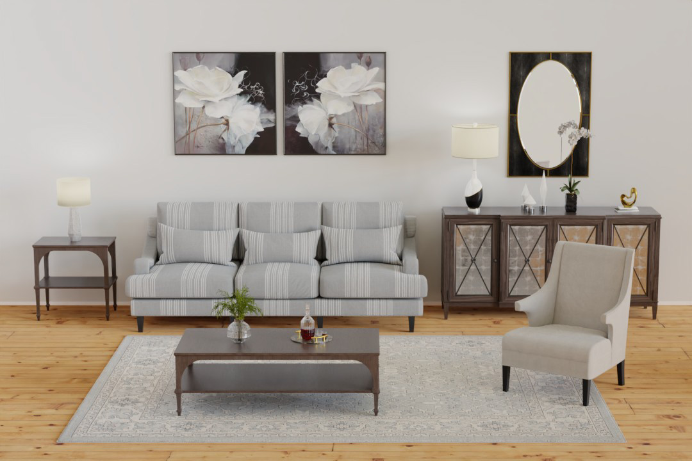

Virtual Staging can be used to transform an empty home into a beautiful and inviting one that will attract much more attention. It is difficult for people to envision how a room will look and feel when there is nothing in it. Virtural Staging gives the potential buyer a much better idea of the possibilies of the home.

## Virtual Staging Example

Below is an example of an empty room along with the virtually staged version.

### Before

### After

## Style Examples

Below are examples of some of the many styles that can be used when virtually staging a room. Remember, these are just a few examples. There are endless possibilities available that can be mixed and matched.

### Modern

### Contemporary

### Rustic

### Traditional

### Luxe (Luxurious/Upscale)

## Staging Options

Here are the types of rooms we can virtually stage to use in your listings:

- Living Room
- Dining Room
- Bedroom
- Bathroom
- Kitchen
- Office
- Basement/Rec Room
- Outdoor/Patio
